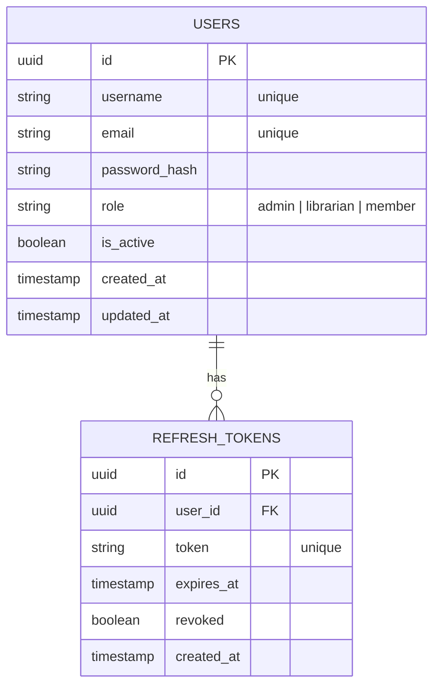
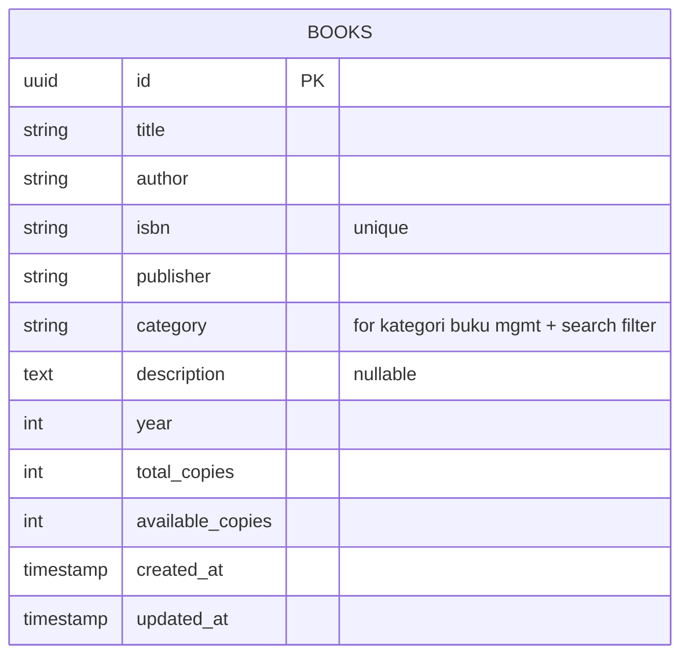
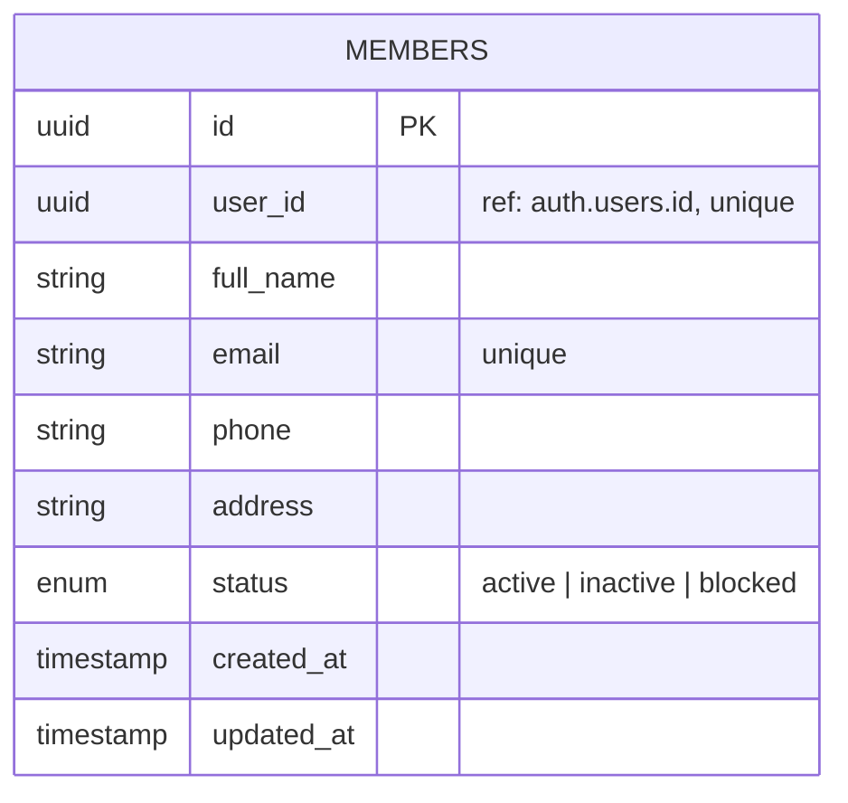
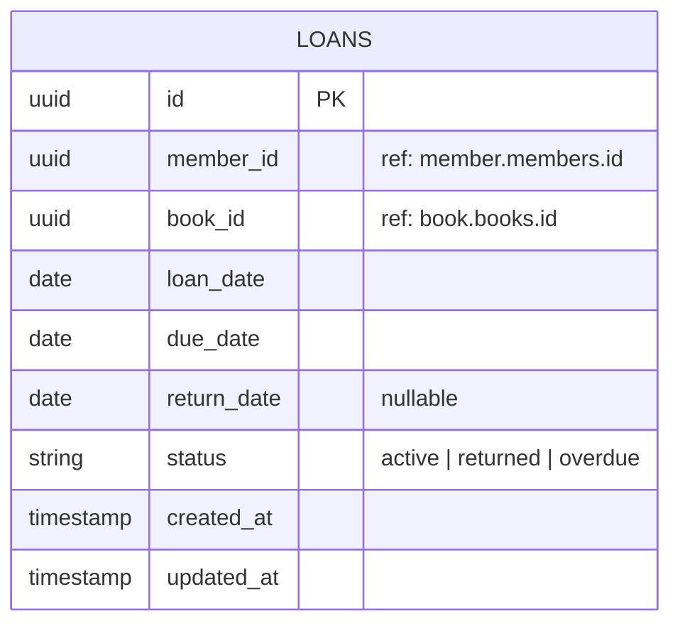
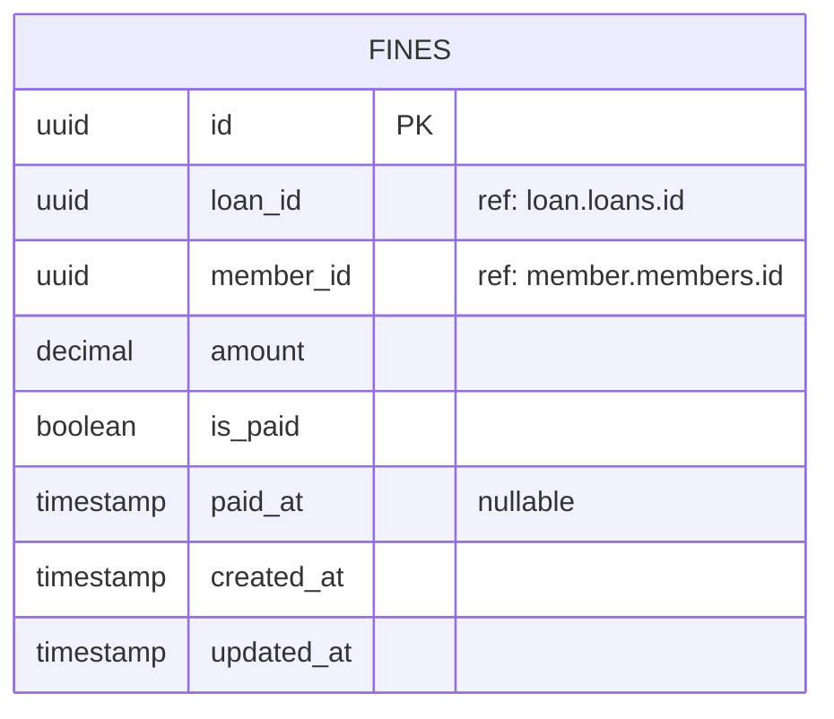

# ERD — microservice-pencari-tuhan

> Setiap service punya database terpisah. Relasi antar service **tidak** melalui foreign key DB,
> melainkan melalui ID reference (aplikasi yang menjaga konsistensinya).

---

## Auth Service DB (`postgres_auth`)

---

## Book Service DB (`postgres_book`)

---

## Member Service DB (`postgres_member`)

---

## Loan Service DB (`postgres_loan`)

---

## Fine Service DB (`postgres_fine`)

---

## Cross-Service Reference Rules

- `loan.member_id` → Member Service di-query via httpx untuk validasi
- `loan.book_id` → Book Service di-query via httpx untuk cek & update stok
- `fine.loan_id` → Loan Service di-query untuk detail keterlambatan
- Tidak ada foreign key lintas database — konsistensi dijaga di application layer

---

## Changelog (Sprint 3 — Book & Member implementation)

- `BOOKS`: tambah `category` + `description` — proposal BAB IV Modul 1 nyebut atribut ini di deskripsi buku, sebelumnya gak ada di ERD. Dipakai juga buat `GET /books/search`.
- `MEMBERS`: ganti `is_active (boolean)` → `status (enum: active/inactive/blocked)` — proposal nyebut 3 status keanggotaan eksplisit (`PATCH /members/{id}/status`), boolean gak cukup buat representasiin "blocked".
